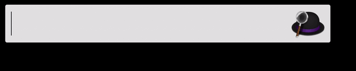

# alfred-jyutping-workflow

Built on [PyJyutping](https://github.com/MacroYau/PyJyutping); converts Characters to Jyutping right on [Alfred](https://www.alfredapp.com).

[Download the workflow](https://github.com/shensquared/alfred-jyutping-workflow/blob/master/jyutping.alfredworkflow).

## Usage
Activates via keyword `yue`.

## Credits
- `PyJyutping` module by [Cheuk-Wang Yau](https://github.com/MacroYau/PyJyutping).